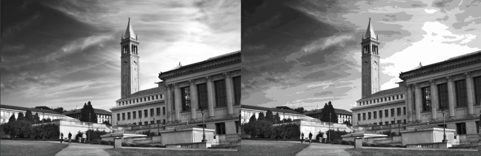

# Evolve
Using **evolutionary-based optimization** methods to develop a universal codebook for **image compression**.

## Overview
In the midst of a myriad of deep-learning approaches to image compression, we attempt to use **simple, interpretable models** to perform the same task. We derive inspiration from natural evolution as a means of optimization (i.e. **genetic algorithms**).

## Design
For each block of a pre-defined size in an image, we attempt to find the most representative codeblock that is most similar to it. The problem thus turns into an optimization problem -- find the most optimal set of codeblocks.

For our genetic algorithm, each individual is a set of codeblocks, which we evolve using the following policies:
* **fitness**: sample 5 random images, reconstruct them according to the set of codeblocks, then average the SSIM values across the test images
* **selection**: fitness-proportionate
* **crossover**: single-point crossover from the set (exchange parts of the set)
* **mutation**: add static noise to random sample of blocks of a random sample of individuals

We can thus represent a single image with a sequence of indices into the set of codeblocks. A custom encoded file is generated that contains the necessary information for a **huffman mapping** in order to leverage the frequency of blocks.

We ultimately decided to run tests on greyscale images to save time, however colored images can be compressed by applying this method to each channel independently.

## Results
The image on the right is the compressed version of the image on the left. We achieved a compression ratio of **4.855**, encode time of **10.48 s**, and decode time of **1.92 s**.

## Conclusion
Our method has a lower bound on the compression ratio of **4:1** which applies to any and all input images. The biggest weakness is its ability to capture gradients by virtue of the fact of its quantization. In the future, we could apply the same paradigm to colored images in a 3-channel parallel fashion and also incorporate an extra dimension of time to our blocks to capture temporal compression of videos.

Check out our [website](https://callaunchpad.github.io/Evolve/)!
